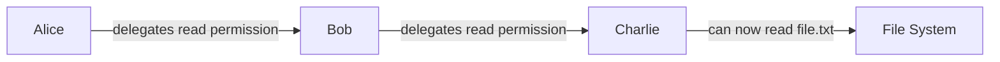

This guide provides a gentle introduction to UCAN (User Controlled Authorization Network) and its core concepts.

> **Note**: The code examples in this guide use the TypeScript UCAN library (`@ucans/ucans`) for illustration. Different UCAN libraries may have different APIs and be at different specification versions. Always refer to your chosen library's documentation for exact API details.

## What is UCAN?

UCAN is a **trustless**, **secure**, **local-first**, **user-originated** authorization scheme that lets you:

- **Delegate authority** without sharing cryptographic keys
- **Work offline** with full authorization capabilities
- **Scale authorization** across distributed systems
- **Maintain user control** over their data and permissions

## Key Concepts

### 1. Capabilities vs Permissions

Traditional systems use **Access Control Lists (ACLs)** - a list of who can do what:
```
Alice can read file.txt
Bob can write file.txt
Charlie can read file.txt
```

UCAN uses **capabilities** - tokens that grant specific abilities:
```
Token A grants "read file.txt"
Token B grants "write file.txt"
```

### 2. Delegation

With UCAN, you can delegate authority to others without sharing your keys:



### 3. Verification

Each UCAN can be verified independently:
- **Cryptographic signatures** prove authenticity
- **Certificate chains** show delegation path
- **No central authority** needed for verification

## Core Specifications

### [UCAN Delegation](/delegation/)
The foundation of UCAN - how to create and delegate capabilities.

**Key features:**
- Cryptographically verifiable
- Hierarchical authority
- Expiration times
- Policy language for conditions

### [UCAN Invocation](/invocation/)
How to execute the capabilities you've been delegated.

**Key features:**
- Clear intention to act
- Proof of authorization
- Execution receipts
- Causal relationships

### [UCAN Revocation](/revocation/)
How to revoke capabilities after they've been issued.

**Key features:**
- Manual invalidation
- Revocation chains
- Last resort security

## Common Use Cases

### 1. File System Access
```javascript
// Using TypeScript UCAN library
import * as ucans from "@ucans/ucans"

// Alice creates a keypair and delegates read access to Bob
const aliceKeypair = await ucans.EdKeypair.create()
const bobDid = "did:key:z6Mk3..." // Bob's DID

const delegation = await ucans.build({
  audience: bobDid,
  issuer: aliceKeypair,
  capabilities: [{
    with: { scheme: "file", hierPart: "///alice/documents/report.pdf" },
    can: { namespace: "fs", segments: ["read"] }
  }],
  lifetimeInSeconds: 3600 // 1 hour
});

// Encode the UCAN for transport
const token = ucans.encode(delegation);

// Bob can verify and use the delegation
const result = await ucans.verify(token, {
  audience: bobDid,
  isRevoked: async ucan => false,
  requiredCapabilities: [{
    capability: {
      with: { scheme: "file", hierPart: "///alice/documents/report.pdf" },
      can: { namespace: "fs", segments: ["read"] }
    },
    rootIssuer: aliceKeypair.did()
  }]
});
```

### 2. API Access
```javascript
// Service owner delegates API access using TypeScript library
import * as ucans from "@ucans/ucans"

const serviceKeypair = await ucans.EdKeypair.create()
const userDid = "did:key:z6MkUser..." // User's DID

const apiAccess = await ucans.build({
  audience: userDid,
  issuer: serviceKeypair,
  capabilities: [{
    with: { scheme: "https", hierPart: "//service.com/api/users" },
    can: { namespace: "api", segments: ["read"] }
  }],
  lifetimeInSeconds: 86400, // 24 hours
  facts: [{
    rateLimit: { requests_per_hour: 100 },
    scope: "public" // only public data
  }]
});
```

### 3. Collaborative Documents
```javascript
// Alice shares edit access to document using TypeScript library
import * as ucans from "@ucans/ucans"

const aliceKeypair = await ucans.EdKeypair.create()
const collaboratorDid = "did:key:z6MkCollab..." // Collaborator's DID

const editAccess = await ucans.build({
  audience: collaboratorDid,
  issuer: aliceKeypair,
  capabilities: [{
    with: { scheme: "doc", hierPart: "//alice/project-proposal" },
    can: { namespace: "doc", segments: ["edit"] }
  }],
  lifetimeInSeconds: 604800, // 1 week
  facts: [{
    allowedSections: ["comments", "suggestions"], // limited sections
    expiry: "2025-12-31T23:59:59Z" // explicit expiry date
  }]
});
```

## Next Steps

1. **Read the specifications** - Start with the [UCAN Delegation](/delegation/) spec
2. **Explore examples** - Check out the detailed [Examples](/guides/examples/) page
3. **Try an implementation** - Choose a UCAN library for your preferred language
4. **Join the community** - Participate in discussions on the UCAN GitHub

## Additional Resources

- [UCAN Website](https://ucan.xyz)
- [GitHub Repository](https://github.com/ucan-wg/spec)
- [Implementation Libraries](https://github.com/ucan-wg)
  - **JavaScript/TypeScript**: [`@ucans/ucans`](https://github.com/ucan-wg/ts-ucan) (NPM: `ucans`)
  - **Rust**: [`ucan`](https://github.com/ucan-wg/rs-ucan)
  - **Go**: [`go-ucan`](https://github.com/ucan-wg/go-ucan)

## Questions?

Common questions about UCAN:

**Q: How is UCAN different from OAuth?**
A: OAuth requires online authorization servers. UCAN works offline and doesn't need central authorities.

**Q: Can I revoke a UCAN after issuing it?**
A: Yes, through the [UCAN Revocation](/revocation/) mechanism, though this requires the revocation message to be delivered.

**Q: Are UCANs secure?**
A: UCANs use public-key cryptography and are designed with security best practices. However, they require proper implementation and key management.

**Q: Can I use UCAN with existing systems?**
A: Yes! UCAN is designed to wrap existing authorization systems while adding its benefits.
