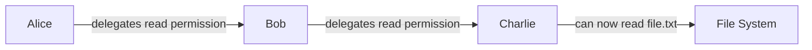

This guide provides a gentle introduction to UCAN (User Controlled Authorization Network) and its core concepts.

## What is UCAN?

UCAN is a **trustless**, **secure**, **local-first**, **user-originated** authorization scheme that lets you:

- **Delegate authority** without sharing cryptographic keys
- **Work offline** with full authorization capabilities
- **Scale authorization** across distributed systems
- **Maintain user control** over their data and permissions

## Key Concepts

### 1. Capabilities vs Permissions

Traditional systems use **Access Control Lists (ACLs)** - a list of who can do what:
```
Alice can read file.txt
Bob can write file.txt
Charlie can read file.txt
```

UCAN uses **capabilities** - tokens that grant specific abilities:
```
Token A grants "read file.txt"
Token B grants "write file.txt"
```

### 2. Delegation

With UCAN, you can delegate authority to others without sharing your keys:



### 3. Verification

Each UCAN can be verified independently:
- **Cryptographic signatures** prove authenticity
- **Certificate chains** show delegation path
- **No central authority** needed for verification

## Core Specifications

### [UCAN Delegation](/delegation/)
The foundation of UCAN - how to create and delegate capabilities.

**Key features:**
- Cryptographically verifiable
- Hierarchical authority
- Expiration times
- Policy language for conditions

### [UCAN Invocation](/invocation/)
How to execute the capabilities you've been delegated.

**Key features:**
- Clear intention to act
- Proof of authorization
- Execution receipts
- Causal relationships

### [UCAN Revocation](/revocation/)
How to revoke capabilities after they've been issued.

**Key features:**
- Manual invalidation
- Revocation chains
- Last resort security

## Common Use Cases

### 1. File System Access
```javascript
// Alice delegates read access to Bob
const delegation = await alice.delegate({
  audience: bob.did(),
  capabilities: [{
    resource: "file://alice/documents/report.pdf",
    ability: "read"
  }],
  expiration: Date.now() + 3600000 // 1 hour
});

// Bob can now read the file
const result = await bob.invoke({
  capability: delegation,
  resource: "file://alice/documents/report.pdf",
  ability: "read"
});
```

### 2. API Access
```javascript
// Service owner delegates API access
const apiAccess = await service.delegate({
  audience: user.did(),
  capabilities: [{
    resource: "api://service.com/users",
    ability: "read",
    conditions: {
      rateLimit: 100, // requests per hour
      scope: "public" // only public data
    }
  }]
});
```

### 3. Collaborative Documents
```javascript
// Alice shares edit access to document
const editAccess = await alice.delegate({
  audience: collaborator.did(),
  capabilities: [{
    resource: "doc://alice/project-proposal",
    ability: "edit",
    conditions: {
      sections: ["comments", "suggestions"], // limited sections
      expiry: "2024-01-01T00:00:00Z"
    }
  }]
});
```

## Next Steps

1. **Read the specifications** - Start with the [UCAN Delegation](/delegation/) spec
2. **Explore examples** - Check out the code samples in each specification
3. **Try an implementation** - Look for UCAN libraries in your preferred language
4. **Join the community** - Participate in discussions on the UCAN GitHub

## Additional Resources

- [UCAN Website](https://ucan.xyz)
- [GitHub Repository](https://github.com/ucan-wg/spec)
- [Implementation Libraries](https://github.com/ucan-wg)

## Questions?

Common questions about UCAN:

**Q: How is UCAN different from OAuth?**
A: OAuth requires online authorization servers. UCAN works offline and doesn't need central authorities.

**Q: Can I revoke a UCAN after issuing it?**
A: Yes, through the [UCAN Revocation](/revocation/) mechanism, though this requires the revocation message to be delivered.

**Q: Are UCANs secure?**
A: UCANs use public-key cryptography and are designed with security best practices. However, they require proper implementation and key management.

**Q: Can I use UCAN with existing systems?**
A: Yes! UCAN is designed to wrap existing authorization systems while adding its benefits.
