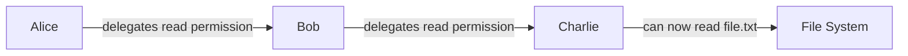

This guide provides a gentle introduction to UCAN (User Controlled Authorization Network) and its core concepts.

> **Note**: The code examples in this guide use the JavaScript UCAN library (`iso-ucan`) for illustration. Different UCAN libraries may have different APIs and be at different specification versions. Always refer to your chosen library's documentation for exact API details.

## What is UCAN?

UCAN is a **trustless**, **secure**, **local-first**, **user-originated** authorization scheme that lets you:

- **Delegate authority** without sharing cryptographic keys
- **Work offline** with full authorization capabilities
- **Scale authorization** across distributed systems
- **Maintain user control** over their data and permissions

## Key Concepts

### 1. Capabilities vs Permissions

Traditional systems use **Access Control Lists (ACLs)** - a list of who can do what:
```
Alice can read file.txt
Bob can write file.txt
Charlie can read file.txt
```

UCAN uses **capabilities** - tokens that grant specific abilities:
```
Token A grants "read file.txt"
Token B grants "write file.txt"
```

### 2. Delegation

With UCAN, you can delegate authority to others without sharing your keys:



### 3. Verification

Each UCAN can be verified independently:
- **Cryptographic signatures** prove authenticity
- **Certificate chains** show delegation path
- **No central authority** needed for verification

## Core Specifications

### [UCAN Delegation](/delegation/)
The foundation of UCAN - how to create and delegate capabilities.

**Key features:**
- Cryptographically verifiable
- Hierarchical authority
- Expiration times
- Policy language for conditions

### [UCAN Invocation](/invocation/)
How to execute the capabilities you've been delegated.

**Key features:**
- Clear intention to act
- Proof of authorization
- Execution receipts
- Causal relationships

### [UCAN Revocation](/revocation/)
How to revoke capabilities after they've been issued.

**Key features:**
- Manual invalidation
- Revocation chains
- Last resort security

## Common Use Cases

### 1. File System Access
```javascript
import { Capability } from 'iso-ucan/capability'
import { Store } from 'iso-ucan/store'
import { MemoryDriver } from 'iso-kv/drivers/memory'
import { EdDSASigner } from 'iso-signatures/signers/eddsa.js'
import { z } from 'zod'

// Set up store for delegation management
const store = new Store(new MemoryDriver())

// Define the file read capability
const FileReadCap = Capability.from({
  schema: z.never(),
  cmd: 'file:///alice/documents/report.pdf#read',
})

// Generate keypairs for Alice and Bob
const alice = await EdDSASigner.generate()
const bob = await EdDSASigner.generate()

const nowInSeconds = Math.floor(Date.now() / 1000)

// Alice delegates read access to Bob
const delegation = await FileReadCap.delegate({
  iss: alice,    // Alice issues the delegation
  aud: bob,      // Bob receives the capability
  sub: alice,    // Alice owns the resource
  pol: [],      // No additional policies
  exp: nowInSeconds + 3600 // Expires in 1 hour
})

// Store the delegation for later use
await store.set(delegation)

// Bob can verify and use the delegation by creating an invocation
const invocation = await FileReadCap.invoke({
  iss: bob,      // Bob is invoking the capability
  sub: alice,    // Alice is the resource owner
  args: {},      // No additional arguments needed
  store,         // Store containing the delegation chain
  exp: nowInSeconds + 300, // Invocation expires in 5 minutes
})
```

### 2. API Access
```javascript
import { Capability } from 'iso-ucan/capability'
import { Store } from 'iso-ucan/store'
import { MemoryDriver } from 'iso-kv/drivers/memory'
import { EdDSASigner } from 'iso-signatures/signers/eddsa.js'
import { z } from 'zod'

const store = new Store(new MemoryDriver())

// Define API access capability with rate limiting constraints
const ApiReadCap = Capability.from({
  schema: z.object({
    rateLimit: z.object({
      requests_per_hour: z.number()
    }),
    scope: z.string()
  }),
  cmd: 'https://service.com/api/users#read',
})

const service = await EdDSASigner.generate()
const user = await EdDSASigner.generate()

const nowInSeconds = Math.floor(Date.now() / 1000)

// Service delegates API access to user
const delegation = await ApiReadCap.delegate({
  iss: service,  // Service issues the delegation
  aud: user,     // User receives the capability
  sub: service,  // Service owns the API
  pol: [],      // No additional policies
  exp: nowInSeconds + 86400, // Expires in 24 hours
})

await store.set(delegation)

// User can invoke the capability
const invocation = await ApiReadCap.invoke({
  iss: user,
  sub: service,
  args: {
    rateLimit: { requests_per_hour: 100 },
    scope: "read"
  },
  store,
  exp: nowInSeconds + 300,
})
```

### 3. Collaborative Documents
```javascript
import { Capability } from 'iso-ucan/capability'
import { Store } from 'iso-ucan/store'
import { MemoryDriver } from 'iso-kv/drivers/memory'
import { EdDSASigner } from 'iso-signatures/signers/eddsa.js'
import { z } from 'zod'

const store = new Store(new MemoryDriver())

// Define document edit capability with constraints
const DocEditCap = Capability.from({
  schema: z.object({
    allowedSections: z.array(z.string()),
    expiry: z.string()
  }),
  cmd: 'doc://alice/project-proposal#edit',
})

const alice = await EdDSASigner.generate()
const collaborator = await EdDSASigner.generate()

const nowInSeconds = Math.floor(Date.now() / 1000)

// Alice shares edit access to document
const delegation = await DocEditCap.delegate({
  iss: alice,        // Alice issues the delegation
  aud: collaborator, // Collaborator receives the capability
  sub: alice,        // Alice owns the document
  pol: [],          // No additional policies
  exp: nowInSeconds + 604800, // Expires in 1 week
})

await store.set(delegation)

// Collaborator can invoke the capability to edit
const invocation = await DocEditCap.invoke({
  iss: collaborator,
  sub: alice,
  args: {
    allowedSections: ["introduction", "methodology"],
    expiry: "2026-12-31T23:59:59Z"
  },
  store,
  exp: nowInSeconds + 300,
})
```

## Next Steps

1. **Read the specifications** - Start with the [UCAN Delegation](/delegation/) spec
2. **Explore examples** - Check out the detailed [Examples](/guides/examples/) page
3. **Try an implementation** - Choose a UCAN library for your preferred language
4. **Join the community** - Participate in discussions on the UCAN GitHub

## Additional Resources

- [UCAN Website](https://ucan.xyz)
- [GitHub Repository](https://github.com/ucan-wg/spec)
- [Implementation Libraries](https://github.com/ucan-wg)
  - **JavaScript**: [`iso-ucan`](https://github.com/hugomrdias/iso-repo/tree/main/packages/iso-ucan) (NPM: `iso-ucan`)
  - **Rust**: [`ucan`](https://github.com/ucan-wg/rs-ucan)
  - **Go**: [`go-ucan`](https://github.com/ucan-wg/go-ucan)

## Questions?

Common questions about UCAN:

**Q: How is UCAN different from OAuth?**
A: OAuth requires online authorization servers. UCAN works offline and doesn't need central authorities.

**Q: Can I revoke a UCAN after issuing it?**
A: Yes, through the [UCAN Revocation](/revocation/) mechanism, though this requires the revocation message to be delivered.

**Q: Are UCANs secure?**
A: UCANs use public-key cryptography and are designed with security best practices. However, they require proper implementation and key management.

**Q: Can I use UCAN with existing systems?**
A: Yes! UCAN is designed to wrap existing authorization systems while adding its benefits.
