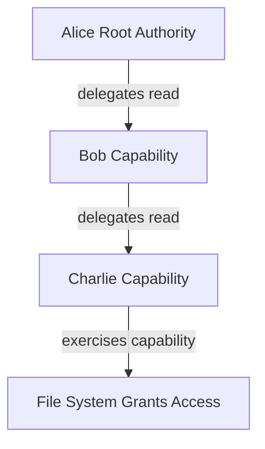
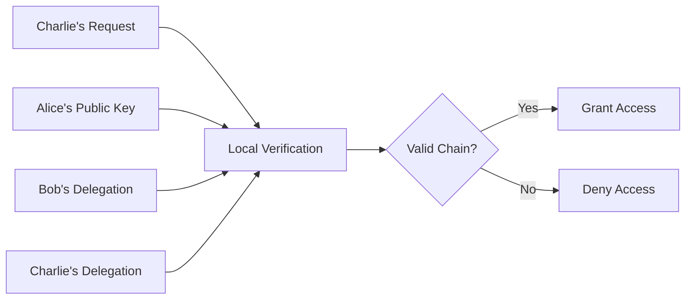

This guide provides a quick introduction to UCAN (User Controlled Authorization Network) and walks you through building your first UCAN-enabled application.

> **Implementation Note**: This guide uses the JavaScript UCAN library (`iso-ucan`) for code examples. Different UCAN libraries may have varying APIs and support different specification versions. Always refer to your chosen library's documentation for exact implementation details.

## What is UCAN?

UCAN is a **decentralized authorization system** that enables secure, offline-capable delegation of permissions without requiring centralized servers or sharing cryptographic keys.

### Core Benefits

- 🔑 **No shared secrets** - Delegate authority without sharing private keys
- 🌐 **Offline-first** - Work without internet connectivity or central servers  
- 🔗 **Chainable** - Create delegation chains across multiple parties
- 🛡️ **Cryptographically secure** - Built on proven public-key cryptography
- ⚡ **Locally verifiable** - No network calls needed for authorization

### How UCAN Differs from Traditional Auth

| Traditional Auth (OAuth, etc.) | UCAN |
|--------------------------------|------|
| Centralized authorization server | Decentralized, peer-to-peer |
| Online verification required | Offline verification possible |
| Shared secrets or tokens | Public-key cryptography |
| Revocation requires server | Revocation via cryptographic proofs |

## Core Concepts

### Capabilities vs Permissions

**Traditional Access Control Lists (ACLs)** define who can do what:
```
Users Table:
- Alice: can read file.txt, write file.txt
- Bob: can read file.txt  
- Charlie: can read file.txt, delete file.txt
```

UCAN uses **capabilities** - tokens that grant specific abilities:
```
Token A grants "read file.txt"
Token B grants "write file.txt"
```

### Delegation Chains

UCAN enables secure delegation without key sharing:



Each delegation:
- ✅ Is cryptographically signed by the delegator
- ✅ Can be verified independently 
- ✅ Can include additional restrictions (attenuation)
- ✅ Has built-in expiration

### Verification Without Servers



## Core Specifications

### [UCAN Delegation](/delegation/)
The foundation of UCAN - how to create and delegate capabilities.

**Key features:**
- Cryptographically verifiable
- Hierarchical authority
- Expiration times
- Policy language for conditions

### [UCAN Invocation](/invocation/)
How to execute the capabilities you've been delegated.

**Key features:**
- Clear intention to act
- Proof of authorization
- Execution receipts
- Causal relationships

### [UCAN Revocation](/revocation/)
How to revoke capabilities after they've been issued.

**Key features:**
- Manual invalidation
- Revocation chains
- Last resort security

## Common Use Cases

### 1. File System Access
```javascript
import { Capability } from 'iso-ucan/capability'
import { Store } from 'iso-ucan/store'
import { MemoryDriver } from 'iso-kv/drivers/memory'
import { EdDSASigner } from 'iso-signatures/signers/eddsa.js'
import { z } from 'zod'

// Set up store for delegation management
// This store will track all delegations and resolve delegation chains
const store = new Store(new MemoryDriver())

// Define the file read capability with schema validation
// The schema ensures that invocations include a valid file path
const FileReadCap = Capability.from({
  schema: z.object({
    path: z.string(),
  }),
  cmd: '/file/read',  // Command identifier following UCAN v1 spec
})

// Generate keypairs for Alice (resource owner) and Bob (delegatee)
// In production, these would be long-lived identity keypairs
const alice = await EdDSASigner.generate()
const bob = await EdDSASigner.generate()

const nowInSeconds = Math.floor(Date.now() / 1000)

// Alice creates a delegation to Bob for file read access
// This grants Bob the authority to read files on Alice's behalf
const delegation = await FileReadCap.delegate({
  iss: alice,    // Alice issues this delegation
  aud: bob,      // Bob is the audience (recipient)
  sub: alice,    // Alice is the subject (resource owner)
  pol: [],      // No additional policy constraints
  exp: nowInSeconds + 3600, // Expires in 1 hour for security
})

// Store the delegation for later lookup during invocation
// The store enables automatic delegation chain resolution
await store.set(delegation)

// Bob can now invoke this capability to read a specific file
// The invocation proves Bob's authority and specifies the action
const invocation = await FileReadCap.invoke({
  iss: bob,      // Bob is invoking the capability
  sub: alice,    // Alice's system will execute the action
  args: {
    path: '/documents/report.pdf'  // Specific file to read
  },
  store,         // Store containing the delegation proof
  exp: nowInSeconds + 300, // Invocation expires in 5 minutes
})
```

### 2. API Access Control
```javascript
import { Capability } from 'iso-ucan/capability'
import { Store } from 'iso-ucan/store'
import { MemoryDriver } from 'iso-kv/drivers/memory'
import { EdDSASigner } from 'iso-signatures/signers/eddsa.js'
import { z } from 'zod'

// Initialize store for managing delegations
const store = new Store(new MemoryDriver())

// Define API read capability with endpoint validation
// Schema ensures the endpoint parameter is a valid string
const ApiReadCap = Capability.from({
  schema: z.object({
    endpoint: z.string(),
  }),
  cmd: '/api/read',  // Command for API read operations
})

// Create keypairs for service owner and client application
// Service owns the API, client needs read access to specific endpoints
const service = await EdDSASigner.generate()
const client = await EdDSASigner.generate()

const nowInSeconds = Math.floor(Date.now() / 1000)

// Service grants client permission to read from API endpoints
// This could be part of an OAuth-like flow with UCAN tokens
const delegation = await ApiReadCap.delegate({
  iss: service,  // Service issues the delegation
  aud: client,   // Client receives the capability
  sub: service,  // Service owns the API resources
  pol: [],      // No additional constraints
  exp: nowInSeconds + 86400, // Valid for 24 hours
})

// Store delegation to enable invocation validation
await store.set(delegation)

// Client invokes the capability to access a specific API endpoint
// This acts as an authorization proof for the API request
const invocation = await ApiReadCap.invoke({
  iss: client,   // Client is making the request
  sub: service,  // Service will process the request
  args: {
    endpoint: '/users/profile'  // Specific API endpoint to access
  },
  store,         // Store with delegation proof
  exp: nowInSeconds + 300, // Request expires in 5 minutes
})
```

### 3. Document Collaboration
```javascript
import { Capability } from 'iso-ucan/capability'
import { Store } from 'iso-ucan/store'
import { MemoryDriver } from 'iso-kv/drivers/memory'
import { EdDSASigner } from 'iso-signatures/signers/eddsa.js'
import { z } from 'zod'

// Set up store for delegation chain management
const store = new Store(new MemoryDriver())

// Define document edit capability with document ID validation
// Schema requires a valid document identifier for all operations
const DocEditCap = Capability.from({
  schema: z.object({
    docId: z.string(),
  }),
  cmd: '/doc/edit',  // Command for document editing operations
})

// Generate keypairs for document owner and collaborator
// Owner controls document permissions, collaborator needs edit access
const owner = await EdDSASigner.generate()
const collaborator = await EdDSASigner.generate()

const nowInSeconds = Math.floor(Date.now() / 1000)

// Owner delegates document editing rights to collaborator
// This enables secure document sharing without password sharing
const delegation = await DocEditCap.delegate({
  iss: owner,        // Document owner issues delegation
  aud: collaborator, // Collaborator receives edit permission
  sub: owner,        // Owner maintains document ownership
  pol: [],          // No additional policy restrictions
  exp: nowInSeconds + 7200, // Valid for 2 hours for secure session
})

// Store the delegation for validation during edit operations
await store.set(delegation)

// Collaborator can now edit the specific document
// This invocation serves as proof of authorization for the edit
const invocation = await DocEditCap.invoke({
  iss: collaborator, // Collaborator is performing the edit
  sub: owner,        // Owner's system processes the edit
  args: {
    docId: 'doc-12345'  // Specific document to edit
  },
  store,             // Store containing the delegation proof
  exp: nowInSeconds + 300, // Edit session expires in 5 minutes
})
```

## Next Steps

1. **Read the specifications** - Start with the [UCAN Delegation](/delegation/) spec
2. **Explore examples** - Check out the detailed [Examples](/guides/examples/) page
3. **Try an implementation** - Choose a UCAN library for your preferred language
4. **Join the community** - Participate in discussions on the UCAN GitHub

## Additional Resources

- [UCAN Website](https://ucan.xyz)
- [UCAN GitHub Working Group](https://github.com/ucan-wg/)
- [Implementation Libraries](/libraries/)
  - **JavaScript**: [`iso-ucan`](/libraries/javascript/) (NPM: `iso-ucan`)
  - **Rust**: [`ucan`](/libraries/rust/)
  - **Go**: [`go-ucan`](/libraries/go/)

## Questions?

Common questions about UCAN:

**Q: How is UCAN different from OAuth?**
A: OAuth requires online authorization servers. UCAN works offline and doesn't need central authorities.

**Q: Can I revoke a UCAN after issuing it?**
A: Yes, through the [UCAN Revocation](/revocation/) mechanism, though this requires the revocation message to be delivered.

**Q: Are UCANs secure?**
A: UCANs use public-key cryptography and are designed with security best practices. However, they require proper implementation and key management.

**Q: Can I use UCAN with existing systems?**
A: Yes! UCAN is designed to wrap existing authorization systems while adding its benefits.
